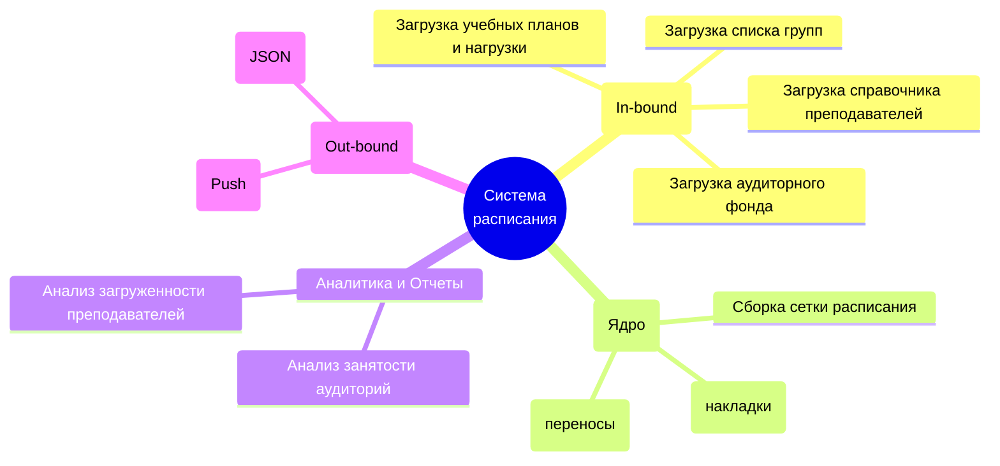

# Документ о концепции и границах кейса

| Поле | Значение |
|------|----------|
| Кейс | _название варианта_ |
| Индустриальный партнер | _организация / подразделение_ |
| Версия | `0.1-draft` |
| Дата | ГГГГ-ММ-ДД |
| Статус | черновик / на ревью / согласовано |
| Авторы | |

> [!NOTE]
> Заполняйте документ на языке заказчика. Образец глубины проработки — [`example/case_concept.md`](../example/case_concept.md). Колонки ID в таблицах шаблона — подсказка структуры, а не обязательная схема нумерации.

## 1. Введение

Краткая выжимка сути кейса: для кого система, какую проблему закрывает и чем отличается от текущего способа работы.

## 2. Бизнес-контекст и цели

### 2.1. Исходные данные

Как процесс устроен сейчас, какие потери времени / денег / качества наблюдаются, на каких фактах это основано.

### 2.2. Возможности бизнеса

Что изменится, если решение появится; какие смежные возможности откроются позже.

### 2.3. Бизнес-цели

| ID | Цель | Масштаб | Способ измерения | База | План | Обязательный порог | Срок |
|----|------|---------|------------------|------|------|--------------------|------|
| BO-1 | | | | | | | |
| BO-2 | | | | | | | |
| BO-3 | | | | | | | |

### 2.4. Видение решения

Одно-два предложения в формате: *для [пользователь], который [потребность], [имя системы] — это [тип продукта], который [ключевые возможности]. В отличие от [альтернатива], решение [отличие]*.

## 3. Стейкхолдеры

### 3.1 Профили заинтересованных лиц

| Стейкхолдер | Описание и роль в проекте | Главная ценность от системы |
| :--- | :--- | :--- |
| **Учебное управление (Заказчик)** | Инициатор проекта. Контролирует весь процесс, принимает итоговый результат. | Исключение ручного дублирования данных, сокращение времени на составление расписания, прозрачная отчетность по загрузке преподавателей и аудиторий. |
| **Диспетчер расписания** | Основной пользователь АРМ (Автоматизированного рабочего места). Человек, который собирает сетку занятий. | Удобный интерфейс сборки расписания (drag-and-drop / автоподстановка), где все справочники уже загружены из 1С. Автоматический контроль накладок. |
| **Студенты** | Конечные потребители расписания. | Быстрый доступ к актуальному расписанию на сегодня/завтра прямо в мессенджере MAX, получение пуш-уведомлений о переносах или отменах пар. |
| **Преподаватели** | Конечные потребители расписания. | Оперативное информирование о своих парах, аудиториях и изменениях в сетке через MAX. |
| **ИТ-отдел университета** | Предоставляет доступ к HTTP-сервисам 1С:Университет ПРОФ. | Снижение нагрузки на техподдержку. Интеграция должна строго соблюдать правила транспорта (таймауты, Basic-авторизацию, ограничения на размер файлов). |
| **Администраторы MAX (ММСИ)** | Предоставляют API для выгрузки расписания в мессенджер. | Корректная отправка POST-запросов (в формате JSON) через их шлюз (University schedule API) без спама и ошибок. |

### 3.2. Матрица влияния / интереса

| Стейкхолдер | Влияние | Интерес | Стратегия взаимодействия |
| :--- | :--- | :--- | :--- |
| Учебное управление | Высокое | Высокий | **Плотно взаимодействовать**. Регулярно согласовывать макеты, логику работы и критерии приемки. |
| ИТ-отдел университета | Высокое | Низкий | **Удовлетворять потребности**. Четко следовать их API-документации, не перегружать серверы частыми запросами. |
| Диспетчер расписания | Низкое | Высокий | **Информировать и вовлекать**. Тестировать на них удобство интерфейса (UX/UI), собирать обратную связь. |
| Студенты и Преподаватели | Низкое | Высокий | **Информировать**. Обеспечить бесперебойную доставку расписания в MAX, сделать понятный чат-бот. |

## 4. Функциональные требования

### 4.1. Основные функции

| ID | Функция | Краткое описание |
|----|---------|------------------|
| FE-1 | | |
| FE-2 | | |

### 4.2. Дерево функций

### 4.3. Пользовательские истории / варианты использования

| Основное действующее лицо | Варианты использования |
|---------------------------|------------------------|
| | |

### 4.4. Детальный сценарий (минимум один)

### 4.4 Детальный сценарий (UC-1)

#### UC-1. Составление и публикация расписания группы на семестр

| Поле | Значение |
|------|----------|
| Автор / дата | Аналитик команды 2 / 2026-10-08 |
| Основное действующее лицо | Диспетчер расписания |
| Дополнительные действующие лица | ИТ-отдел университета, Администраторы MAX (API мессенджера) |
| Описание | Диспетчер собирает сетку занятий для выбранной учебной группы на основе загруженных справочников (дисциплины, аудитории, преподаватели) и отправляет готовое расписание в мессенджер MAX. |
| Условие-триггер | Диспетчер инициирует создание или редактирование расписания для конкретной группы перед началом нового семестра. |
| Предварительные условия | PRE-1. Справочники преподавателей, аудиторий, групп и учебных планов успешно загружены из 1С:Университет ПРОФ. |
| Выходные условия | POST-1. Расписание группы сохранено в базе данных без ресурсных конфликтов. POST-2. Расписание отправлено в MAX (или сформирован Excel-файл для отправки). |
| Приоритет | Высокий (Критический функционал) |
| Частота использования | Периодически (интенсивно в период составления расписания перед семестром, реже — для точечных корректировок). |
| Бизнес-правила | BR-1. Преподаватель не может вести два занятия одновременно. BR-2. Аудитория не может быть занята разными группами одновременно (кроме потоковых лекций). |

**Нормальное направление**

1. Диспетчер выбирает факультет, семестр и целевую учебную группу.
2. Система отображает пустую сетку расписания и список доступных дисциплин с нераспределенной нагрузкой для этой группы.
3. Диспетчер выбирает дисциплину и помещает её в свободную ячейку (дата, номер пары).
4. Система запрашивает выбор типа занятия (лекция/практика), преподавателя и аудитории.
5. Диспетчер выбирает преподавателя и аудиторию из предложенных списков (списки отфильтрованы по привязке к кафедре и типу помещения).
6. Система проверяет отсутствие конфликтов ресурсов (преподаватель свободен, аудитория свободна).
7. Диспетчер повторяет шаги 3-6 до распределения всей необходимой нагрузки.
8. Диспетчер нажимает кнопку "Опубликовать в MAX".
9. Система формирует массив данных в формате JSON и отправляет POST-запрос к API МАХ (University schedule API).
10. Система уведомляет диспетчера об успешной публикации.

**Альтернативные направления**

- 4.1. *Назначение потоковой лекции:* На шаге 4 диспетчер указывает, что занятие потоковое, и добавляет дополнительные группы. На шаге 5 система предлагает только аудитории с подходящим "Количеством посадочных мест". На шаге 6 занятие бронируется для всех выбранных групп одновременно.
- 9.1. *Экспорт в Excel:* На шаге 8 диспетчер вместо API выбирает "Экспорт". Система генерирует `.xlsx` файл по регламентированному шаблону МАХ (Шаблон загрузки расписания 22.01.xlsx) для последующей ручной отправки по почте.

**Исключения**

- 6.0.E1. *Конфликт преподавателя:* Выбранный преподаватель уже занят в это время другой группой. Система блокирует сохранение ячейки, выводит красное уведомление "Преподаватель занят (Группа Х, Аудитория Y)" и требует выбрать другого преподавателя или другое время.
- 6.0.E2. *Конфликт аудитории:* Выбранная аудитория занята. Система блокирует сохранение ячейки, выводит уведомление о занятости и предлагает выбрать другую аудиторию.
- 9.0.E1. *Ошибка API MAX:* Сервер МАХ недоступен (таймаут) или вернул ошибку авторизации. Система сохраняет расписание локально, присваивает статус "Ошибка публикации" и предлагает повторить отправку позже.

**Другая информация**

- Интерфейс выбора аудиторий и преподавателей должен поддерживать быстрый поиск по части названия/ФИО.

**Предположения**

- Предполагается, что данные, полученные из 1С:Университет ПРОФ, являются эталонными и не содержат критических дубликатов (например, два преподавателя с одинаковым ФИО и без привязки к кафедре).
 

### 4.5. Сжатые сценарии (по образцу Вигерса)

Остальные UC можно описать короче, если ключевая информация уже есть в другом источнике.

#### UC-n. _Название_

- Описание:
- Исключения:
- Приоритет:
- Бизнес-правила:
- Другая информация:

## 5. Нефункциональные требования

| ID | Категория | Требование | Метрика / порог |
|----|-----------|------------|-----------------|
| NFR-P1 | Производительность | | |
| NFR-A1 | Доступность | | |
| NFR-S1 | Безопасность | | |
| NFR-C1 | Совместимость / IT-ландшафт | | |
| NFR-U1 | Удобство использования | | |

## 6. Границы кейса

### 6.1. In Scope

- …

### 6.2. Out of Scope

- …

### 6.3. Состав первого и последующих выпусков

| Функция | Выпуск 1 | Выпуск 2 | Выпуск 3 |
|---------|----------|----------|----------|
| FE-1 | | | |
| FE-2 | | | |

## 7. Ограничения и допущения

### 7.1. Ограничения и исключения

| ID | Формулировка |
|----|--------------|
| LI-1 | |

### 7.2. Предположения и зависимости

| ID | Тип | Формулировка |
|----|-----|--------------|
| AS-1 | допущение | |
| DE-1 | зависимость | |

### 7.3. Приоритеты проекта

| Область | Ограничения | Движущая сила | Степень свободы |
|---------|-------------|---------------|-----------------|
| Функции | | | |
| Качество | | | |
| Сроки | | | |
| Расходы | | | |
| Персонал | | | |

### 7.4. Особенности развертывания

Стек, инфраструктура, обучение пользователей, необходимые изменения смежных систем.

## 8. Риски

| ID | Риск | Вероятность (0–1) | Ущерб (1–10) | Митигация |
|----|------|-------------------|--------------|-----------|
| RI-1 | | | | |

> [!WARNING]
> Риски, которые могут сорвать приемку выпуска 1, вынесите сюда явно.

## 9. Критерии приемки

| ID | Критерий | Как проверяется | Порог | Срок |
|----|----------|-----------------|-------|------|
| SM-1 | | | | |
| AC-1 | | | | |

Партнер принимает работу, если выполнены все критерии со статусом «обязательный» и закрыты In Scope функции выпуска 1.
