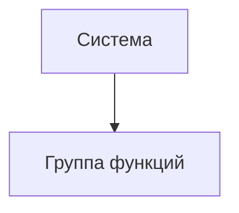

# Документ о концепции и границах кейса

| Поле | Значение |
|------|----------|
| Кейс | _название варианта_ |
| Индустриальный партнер | _организация / подразделение_ |
| Версия | `0.1-draft` |
| Дата | ГГГГ-ММ-ДД |
| Статус | черновик / на ревью / согласовано |
| Авторы | |

> [!NOTE]
> Заполняйте документ на языке заказчика. Образец глубины проработки — [`example/case_concept.md`](../example/case_concept.md). Колонки ID в таблицах шаблона — подсказка структуры, а не обязательная схема нумерации.

## 1. Введение

Краткая выжимка сути кейса: для кого система, какую проблему закрывает и чем отличается от текущего способа работы.

## 2. Бизнес-контекст и цели

### 2.1. Исходные данные

Как процесс устроен сейчас, какие потери времени / денег / качества наблюдаются, на каких фактах это основано.

### 2.2. Возможности бизнеса

Что изменится, если решение появится; какие смежные возможности откроются позже.

### 2.3. Бизнес-цели

| ID | Цель | Масштаб | Способ измерения | База | План | Обязательный порог | Срок |
|----|------|---------|------------------|------|------|--------------------|------|
| BO-1 | | | | | | | |
| BO-2 | | | | | | | |
| BO-3 | | | | | | | |

### 2.4. Видение решения

Одно-два предложения в формате: *для [пользователь], который [потребность], [имя системы] — это [тип продукта], который [ключевые возможности]. В отличие от [альтернатива], решение [отличие]*.

## 3. Стейкхолдеры

### 3.1. Профили заинтересованных лиц

| Заинтересованное лицо | Основная ценность | Отношение | Основные интересы | Ограничения |
|-----------------------|-------------------|-----------|-------------------|-------------|
| | | | | |

### 3.2. Матрица влияния / интереса

| Стейкхолдер | Влияние (низкое / среднее / высокое) | Интерес (низкий / средний / высокий) | Стратегия работы |
|-------------|--------------------------------------|--------------------------------------|------------------|
| | | | |

## 4. Функциональные требования

### 4.1. Основные функции

| ID | Функция | Краткое описание |
|----|---------|------------------|
| FE-1 | | |
| FE-2 | | |

### 4.2. Дерево функций

### 4.3. Пользовательские истории / варианты использования

| Основное действующее лицо | Варианты использования |
|---------------------------|------------------------|
| | |

### 4.4. Детальный сценарий (минимум один)

#### UC-1. _Название_

| Поле | Значение |
|------|----------|
| Автор / дата | |
| Основное действующее лицо | |
| Дополнительные действующие лица | |
| Описание | |
| Условие-триггер | |
| Предварительные условия | PRE-1. |
| Выходные условия | POST-1. |
| Приоритет | высокий / средний / низкий |
| Частота использования | |
| Бизнес-правила | BR-… |

**Нормальное направление**

1.
2.

**Альтернативные направления**

- 1.1 …

**Исключения**

- 1.0.E1 …

**Другая информация**

-

**Предположения**

-

### 4.5. Сжатые сценарии (по образцу Вигерса)

Остальные UC можно описать короче, если ключевая информация уже есть в другом источнике.

#### UC-n. _Название_

- Описание:
- Исключения:
- Приоритет:
- Бизнес-правила:
- Другая информация:

## 5. Нефункциональные требования

| ID | Категория | Требование | Метрика / порог |
|----|-----------|------------|-----------------|
| NFR-P1 | Производительность | | |
| NFR-A1 | Доступность | | |
| NFR-S1 | Безопасность | | |
| NFR-C1 | Совместимость / IT-ландшафт | | |
| NFR-U1 | Удобство использования | | |

## 6. Границы кейса

### 6.1. In Scope

- Импорт данных из корпоративных систем вуза (FE-1)
- Интерактивное рабочее место диспетчера (FE-2)
- Контроль пересечений в расписании (FE-3)
- Отчетность по загруженности ресурсов (FE-4)
- Интеграция с платформой MAX (FE-5)
- Оперативное ведение изменений (FE-6)

### 6.2. Out of Scope

- LI-1. Разработка мобильных приложений для студентов и преподавателей не входит в проект; доставка расписания и уведомлений конечному пользователю делегируется готовому мини-приложению и чат-боту платформы MAX.
- LI-2. Первичный учет и редактирование кадрового состава, контингента студентов, аудиторий и учебных планов производятся во внешних корпоративных системах вуза; создание экранных форм для заведения этих сущностей исключено из системы.
- LI-3. В рамках первого выпуска система охватывает только учебный процесс очного отделения головного кампуса вуза (без учета территориально удаленных филиалов).
- Составление расписания промежуточной аттестации (зачетно-экзаменационной сессии) - не в выпуске 1.
- Полностью автоматическое составление расписания на базе нейросетей - не в выпуске 1.
- Учет посещаемости занятий и ведение электронных журналов успеваемости - не входит в проект

### 6.3. Состав первого и последующих выпусков

| Функция | Выпуск 1 | Выпуск 2 | Выпуск 3 |
|---------|----------|----------|----------|
| FE-1. Импорт данных из систем вуза | Пакетная синхронизация справочников и утвержденной нагрузки по кнопке/расписанию из выгрузок ИТ-отдела | Автоматическое отслеживание изменений нормативно-справочной информации и фоновое обновление базы | Двусторонние вебхуки при изменениях в кадровой системе и контингенте студентов |
| FE-2. Составление расписания | Сеточный интерактивный drag-and-drop конструктор, фильтры по группам, аудиториям, преподавателям; очная форма | Поддержка потоковых лекций, деления на подгруппы и очно-заочной формы обучения | Массовое тиражирование сеток между семестрами, мастер быстрого переноса циклов |
| FE-3. Контроль пересечений | Жесткая блокировка базовых конфликтов (накладка преподавателя, накладка аудитории, накладка группы) | Проверка вместимости аудиторий, учет сменности и санитарных норм по перерывам | Контроль индивидуальных пожеланий преподавателей (методические дни) |
| FE-4. Аналитика и отчетность | Табличные отчеты по загруженности аудиторий (%) и преподавателей (часы) с экспортом в PDF | Интерактивные дашборды и тепловые карты загрузки корпусов в реальном времени | Прогнозирование дефицита аудиторного фонда при изменении контингента |
| FE-5. Интеграция с мессенджером MAX | Пакетный экспорт справочников и сетки семестра через API | Автоматическая отправка точечных изменений в событиях расписания | Мониторинг статуса доставки и статистика обращений к расписанию в MAX |
| FE-6. Оперативные изменения и нотификации | Ручная фиксация замен/отмен в сетке диспетчером; повторная выгрузка в MAX | Автоматический триггер push-уведомлений студентам и преподавателям в чат-боте MAX | Заявки преподавателей на перенос занятий с подтверждением диспетчером |

## 7. Ограничения и допущения

### 7.1. Ограничения и исключения

См. ограничения LI-1, LI-2 и LI-3 в подразделе 6.2. Out of Scope.

### 7.2. Предположения и зависимости

| ID | Тип | Формулировка |
|----|-----|--------------|
| AS-1 | допущение | Справочные данные (аудитории, преподаватели, группы, учебные планы) в корпоративных системах ИТ-отдела актуальны, очищены от дубликатов и содержат стабильные идентификаторы |
| AS-2 | допущение | Сервер приложения имеет сетевой доступ к корпоративным базам вуза в локальном контуре и защищенный HTTPS-доступ во внешнюю сеть к шлюзу API сервиса MAX |
| AS-3 | допущение | Студенты и преподаватели используют мессенджер MAX и подключены к официальному чат-боту вуза |
| DE-1 | зависимость | Проект критически зависит от доступности и спецификации внешнего API University schedule (v1.0.11 OAS 3.0) сервиса MAX; изменения контракта требуют обновления коннектора |
| DE-2 | зависимость | Для активации интеграции учебное управление должно получить авторизационный токен в службе поддержки digital.vuz@max.ru |
| DE-3 | зависимость | Корректность импорта зависит от форматов выгрузки и протоколов доступа, переданных ИТ-отделом университета (1С, реляционная БД или API) |

### 7.3. Приоритеты проекта

| Область | Ограничения | Движущая сила | Степень свободы |
|---------|-------------|---------------|-----------------|
| Функции | Все функции, запланированные на выпуск 1.0 (импорт без ручного ввода, конструктор расписания, базовые отчеты, экспорт в MAX), должны быть полностью реализованы | | |
| Качество | 100% блокировка пересечений преподавателей и аудиторий; 95% успешного прохождения сценариев приемочного тестирования; полное соответствие контракту API MAX | | |
| Сроки | | | Релиз выпуска 1.0 должен состояться за 2 недели до начала учебного семестра; допустимо смещение сроков не более чем на 7 календарных дней по согласованию с куратором |
| Расходы | | | Бюджет фиксирован рамками студенческой разработки; превышение использования инфраструктурных мощностей вуза не более 10% без пересмотра куратором |
| Персонал | | | Команда проекта: аналитик, 2 разработчика, инженер по интеграции/тестированию; при необходимости привлекается консультант ИТ-отдела вуза на четверть ставки |

### 7.4. Особенности развертывания

Серверная часть приложения развертывается во внутреннем контуре университета на серверах под управлением Linux в изолированных Docker-контейнерах. Для работы интеграционного шлюза с сервисом MAX необходимо настроить исходящее HTTPS-соединение через сетевой экран вуза к домену schedule.vk-apps.com (или выделенному адресу шлюза) и применить сервисный Bearer-токен, полученный от digital.vuz@max.ru. Для диспетчеров учебного управления подготавливаются короткие видеоинструкции (длительностью до 5 минут) и интерактивный тур по интерфейсу, обучающие быстрой раскладке занятий по сетке и работе с отчетами загрузки.

## 8. Риски

| ID | Риск | Вероятность (0–1) | Ущерб (1–10) | Митигация |
|----|------|-------------------|--------------|-----------|
| RI-1 | Низкое качество исходных данных вуза: некорректные идентификаторы, дубли преподавателей или неполная сетка нагрузки в базах ИТ-отдела | 0,7 | 8 | Реализовать строгий шлюз предвалидации при импорте с формированием детального отчета об ошибках для ИТ-отдела до начала сборки сетки |
| RI-2 | Изменения в контракте внешнего API сервиса MAX либо сетевая недоступность внешнего шлюза на стороне мессенджера | 0,3 | 8 | Вынести интеграцию в изолированный модуль-адаптер; предусмотреть локальное сохранение сформированных пакетов данных и механизм повторной отправки (retry) |
| RI-3 | Превышение лимитов пропускной способности (Rate Limiting) шлюза MAX при пакетной публикации тысяч занятий | 0,5 | 6 | Реализовать пакетную отправку через асинхронную очередь с батчингом (дроблением на порции по 100–300 записей) и задержками между запросами |
| RI-4 | Сопротивление диспетчеров: нежелание переходить с привычных таблиц Excel на новый интерфейс веб-приложения | 0,5 | 5 | Проектировать интерфейс по привычной ментальной модели сетки Excel с поддержкой горячих клавиш; провести очное обучение диспетчера |
| RI-5 | Лавинообразные точечные правки в первую неделю семестра (переносы, смены аудиторий), приводящие к блокировкам базы | 0,8 | 4 | Оптимизировать транзакции точечных обновлений; реализовать буферизацию (debounce) уведомлений перед отправкой в MAX |

> [!WARNING]
> Наибольший совокупный ущерб связан с качеством исходных данных (риск RI-1). Поскольку ключевой принцип заказчика исключает ручной ввод справочников, работоспособность конструктора напрямую зависит от валидности данных, переданных ИТ-отделом. Модуль импорта должен сразу отсекать некорректные записи с генерацией диагностического журнала.

## 9. Критерии приемки

| ID | Критерий | Как проверяется | Порог | Срок |
|----|----------|-----------------|-------|------|
| SM-1 | Сокращение срока формирования и публикации чистового расписания на семестр | Хронометраж процесса учебного управления от получения нагрузки до публикации | Не более 7 рабочих дней | Приемка выпуска 1 |
| SM-2 | Полное исключение дублирующего ручного ввода справочных данных | Аудит журнала создания сущностей в базе данных приложения | 100% данных (0 сущностей, введенных диспетчером вручную) | Приемка выпуска 1 |
| SM-3 | Отсутствие накладок в опубликованном расписании | Анализ сетки и проверка отчетов об инцидентах за первую учебную неделю | 0 накладок аудиторий, преподавателей и учебных групп | 1-я неделя семестра |
| SM-4 | Охват аудитории через сервис расписания в MAX | Аналитика просмотров мини-приложения и обращений к боту вуза | Не менее 75% студентов и 60% преподавателей | 1 месяц после релиза |
| SM-5 | Время формирования аналитического отчета по загрузке аудиторий и преподавателей | Замер времени генерации отчета в веб-интерфейсе | Менее 5 секунд на построение любого сводного отчета | Приемка выпуска 1 |
| AC-1 | Реализация функционального объема выпуска 1 (MVP) | Чек-лист проверки FE-1, FE-2, FE-3, FE-4, FE-5 | 100% запланированных сценариев выпуска 1 | Приемка выпуска 1 |
| AC-2 | Корректность интеграции с платформой MAX | Успешная передача тестовых массивов через /v1/bulk/* и корректное отображение в мини-приложении | Код ответа HTTP 200/201 от API MAX; отсутствие ошибок парсинга | Приемка выпуска 1 |
| AC-3 | Надежность и безопасность | Тестирование ролевого доступа и валидация персональных данных | 100% тестов защищенности; доступ к редактированию только у диспетчера | Приемка выпуска 1 |

Учебное управление принимает систему выпуска 1, если в полном объеме выполнены критерии AC-1, AC-2 и AC-3, подтверждающие готовность конструктора, чистоту интеграции с API MAX и блокировку пересечений в расписании. Метрики эффективности SM-1...SM-5 служат целевыми показателями (KPI) ввода системы в постоянную эксплуатацию и оцениваются по итогам сборки первого семестрового расписания и работы сервиса в мессенджере.
