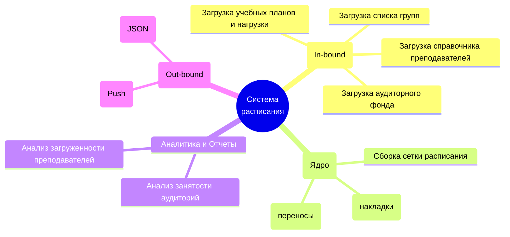

# Документ о концепции и границах кейса

| Поле | Значение |
|------|----------|
| Кейс | Расписание занятий в MAX |
| Индустриальный партнер | Учебное управление университета РИАТПО |
| Версия | `0.1-draft` |
| Дата | 2026-10-07 |
| Статус | Черновик |
| Авторы | Ежов Д.Д., Игнатов М.Р., Тюрин С.С.|

## 1. Введение

Учебное управление университета тратит слишком много времени на сборку расписания: данные о факультетах, кафедрах, аудиториях, преподавателях, группах и учебных планах уже есть в 1С:Университет ПРОФ, но их перепечатывают заново. Из-за этого расписание появляется поздно, ошибки всплывают в первую учебную неделю, а загрузку преподавателей и аудиторий приходится считать вручную. Студенты и преподаватели ищут расписание на портале.

Система расписания занятий в MAX решает эти проблемы: она автоматически загружает справочники из 1С:Университет, позволяет диспетчеру собрать расписание на сетке и публикует его в мини-приложении в чат-боте в MAX. Студенты и преподаватели видят актуальное расписание там, где уже читают сообщения, и получают уведомления об изменениях.В отличие от текущего способа работы, когда расписание собирается вручную в таблицах, а данные перепечатываются из информационных систем, решение использует уже имеющиеся данные и сокращает ручной ввод. Готовое расписание автоматически доходит до студентов и преподавателей в MAX.

## 2. Бизнес-контекст и цели

### 2.1. Исходные данные

Сейчас расписание собирается слишком долго. 
Одни сотрудники или даже один заводят кафедры и аудитории, другие преподавателей и группы, сводят сетку занятий в таблицах. 
Данные при этом уже есть в информационных системах, но ими почти не пользуются,  итоге всё перепечатывают заново.

Из-за этого расписание появляется поздно, ошибки всплывают уже в первую учебную неделю.

Готовое расписание не доходит до студентов и преподавателей удобным способом, они ищут файл на портале во многих вложенных вкладках пытаясь добраться до файла с расписанием, скачивает, а если это не то расписание, может получить раздражение.

### 2.2. Возможности бизнеса

Если решение появится, учебное заведение сможет собирать расписание быстрее и с меньшим числом ручных операций. Данные о факультетах, кафедрах, аудиториях, преподавателях, группах и учебных планах будут загружаться из 1С:Университет автоматически.

Учебное управление получит отчёты по загрузке преподавателей и аудиторий чтобы принимать решения: где перегруз, где простой, где нельзя поставить ещё одну пару.

Готовое расписание будет уходить в мессенджер MAX, то есть студенты и преподаватели увидят его там, где уже читают сообщения.

В дальнейшем можно например расширить систему в целом: публикацию расписания сессии, интеграцию с другими сервисами университета, типо персонально для студента если он состоит в какой либо организации вуза, то пары будут пересекаться с мероприятиями через /.

### 2.3. Бизнес-цели

| ID | Цель | Масштаб | Способ измерения | База | План | Обязательный порог | Срок |
|----|------|---------|------------------|------|------|--------------------|------|
| BO-1 | Сократить время сборки расписания на семестр | Трудозатраты учебного управления |Замер времени от начала сборки до публикации | | −50%|−30% |В течение первого семестра после запуска |
| BO-2 | Обеспечить прозрачную загрузку преподавателей и аудиторий|Наличие отчётов в системе |Проверка доступности отчётов |всё вручную |2 отчёта |2 отчёта | К концу выпуска  |
| BO-3 |Донести расписание до студентов и преподавателей в MAX | Доля людей, видящих расписание в MAX|Статистика мини-приложения и чат-бота | 0% | ≥80% |≥60% |В течение 3 месяцев после запуска |

### 2.4. Видение решения

Для управления университета, которое собирает расписание на семестр, система расписания занятий в MAX — это мини-приложение и чат-бот в MAX, которое автоматически загружает справочники и публикует готовое расписание в MAX. 

## 3. Стейкхолдеры

### 3.1 Профили заинтересованных лиц

| Стейкхолдер | Описание и роль в проекте | Главная ценность от системы |
| :--- | :--- | :--- |
| **Учебное управление (Заказчик)** | Инициатор проекта. Контролирует весь процесс, принимает итоговый результат. | Исключение ручного дублирования данных, сокращение времени на составление расписания, прозрачная отчетность по загрузке преподавателей и аудиторий. |
| **Диспетчер расписания** | Основной пользователь АРМ (Автоматизированного рабочего места). Человек, который собирает сетку занятий. | Удобный интерфейс сборки расписания (drag-and-drop / автоподстановка), где все справочники уже загружены из 1С. Автоматический контроль накладок. |
| **Студенты** | Конечные потребители расписания. | Быстрый доступ к актуальному расписанию на сегодня/завтра прямо в мессенджере MAX, получение пуш-уведомлений о переносах или отменах пар. |
| **Преподаватели** | Конечные потребители расписания. | Оперативное информирование о своих парах, аудиториях и изменениях в сетке через MAX. |
| **ИТ-отдел университета** | Предоставляет доступ к HTTP-сервисам 1С:Университет ПРОФ. | Снижение нагрузки на техподдержку. Интеграция должна строго соблюдать правила транспорта (таймауты, Basic-авторизацию, ограничения на размер файлов). |
| **Администраторы MAX (ММСИ)** | Предоставляют API для выгрузки расписания в мессенджер. | Корректная отправка POST-запросов (в формате JSON) через их шлюз (University schedule API) без спама и ошибок. |

### 3.2. Матрица влияния / интереса

| Стейкхолдер | Влияние | Интерес | Стратегия взаимодействия |
| :--- | :--- | :--- | :--- |
| Учебное управление | Высокое | Высокий | **Плотно взаимодействовать**. Регулярно согласовывать макеты, логику работы и критерии приемки. |
| ИТ-отдел университета | Высокое | Низкий | **Удовлетворять потребности**. Четко следовать их API-документации, не перегружать серверы частыми запросами. |
| Диспетчер расписания | Низкое | Высокий | **Информировать и вовлекать**. Тестировать на них удобство интерфейса (UX/UI), собирать обратную связь. |
| Студенты и Преподаватели | Низкое | Высокий | **Информировать**. Обеспечить бесперебойную доставку расписания в MAX, сделать понятный чат-бот. |

## 4. Функциональные требования

### 4.1. Основные функции

| ID | Функция | Краткое описание |
|----|---------|------------------|
| FE-1 | Автоматическая загрузка справочников из 1С:Университет| Факультеты, кафедры, аудитории, корпуса, преподаватели, группы, учебные планы, дисциплины|
| FE-2 | Сборка расписания диспетчером на сетке| Диспетчер раскладывает занятия по дням и парам, используя данные из 1С |
| FE-3 | Проверка конфликтов | Преподаватель, аудитория, группа чтобы не пересекались |
| FE-4 | Отчёты по загрузке преподавателей и аудиторий | Отдельные отчёты для учебного управления |
| FE-5 | Публикация расписания в MAX | Чат-бот |
| FE-6 | Уведомления об изменениях | Смена аудитории, перенос, отмена, замена преподавателя |

### 4.2. Дерево функций

### 4.3. Пользовательские истории / варианты использования

| Основное действующее лицо | Варианты использования |
|---------------------------|------------------------|
|Диспетчер/составитель расписаний | Сборка расписания, разрешение конфликтов, публикация расписания|
| Преподаватель | Просмотр своего расписания в MAX, получение уведомлений об изменениях |
| Студент | Просмотр расписания своей группы в MAX, получение уведомлений об изменениях |
| Учебное заведение | Согласование исключений, просмотр отчётов по загрузке |
| ИТ-отдел | Настройка интеграции с 1С, поддержка моральная |
| MAX | Доставка расписания студентам и преподавателям |

### 4.4. Детальный сценарий (минимум один)

### 4.4 Детальный сценарий (UC-1)

#### UC-1. Составление и публикация расписания группы на семестр

| Поле | Значение |
|------|----------|
| Автор / дата | Аналитик команды 2 / 2026-10-08 |
| Основное действующее лицо | Диспетчер расписания |
| Дополнительные действующие лица | ИТ-отдел университета, Администраторы MAX (API мессенджера) |
| Описание | Диспетчер собирает сетку занятий для выбранной учебной группы на основе загруженных справочников (дисциплины, аудитории, преподаватели) и отправляет готовое расписание в мессенджер MAX. |
| Условие-триггер | Диспетчер инициирует создание или редактирование расписания для конкретной группы перед началом нового семестра. |
| Предварительные условия | PRE-1. Справочники преподавателей, аудиторий, групп и учебных планов успешно загружены из 1С:Университет ПРОФ. |
| Выходные условия | POST-1. Расписание группы сохранено в базе данных без ресурсных конфликтов. POST-2. Расписание отправлено в MAX (или сформирован Excel-файл для отправки). |
| Приоритет | Высокий (Критический функционал) |
| Частота использования | Периодически (интенсивно в период составления расписания перед семестром, реже - для точечных корректировок). |
| Бизнес-правила | BR-1. Преподаватель не может вести два занятия одновременно. BR-2. Аудитория не может быть занята разными группами одновременно (кроме потоковых лекций). |

**Нормальное направление**

1. Диспетчер выбирает факультет, семестр и целевую учебную группу.
2. Система отображает пустую сетку расписания и список доступных дисциплин с нераспределенной нагрузкой для этой группы.
3. Диспетчер выбирает дисциплину и помещает её в свободную ячейку (дата, номер пары).
4. Система запрашивает выбор типа занятия (лекция/практика), преподавателя и аудитории.
5. Диспетчер выбирает преподавателя и аудиторию из предложенных списков (списки отфильтрованы по привязке к кафедре и типу помещения).
6. Система проверяет отсутствие конфликтов ресурсов (преподаватель свободен, аудитория свободна).
7. Диспетчер повторяет шаги 3-6 до распределения всей необходимой нагрузки.
8. Диспетчер нажимает кнопку "Опубликовать в MAX".
9. Система формирует массив данных в формате JSON и отправляет POST-запрос к API МАХ (University schedule API).
10. Система уведомляет диспетчера об успешной публикации.

**Альтернативные направления**

- 4.1. *Назначение потоковой лекции:* На шаге 4 диспетчер указывает, что занятие потоковое, и добавляет дополнительные группы. На шаге 5 система предлагает только аудитории с подходящим "Количеством посадочных мест". На шаге 6 занятие бронируется для всех выбранных групп одновременно.
- 9.1. *Экспорт в Excel:* На шаге 8 диспетчер вместо API выбирает "Экспорт". Система генерирует `.xlsx` файл по регламентированному шаблону МАХ (Шаблон загрузки расписания 22.01.xlsx) для последующей ручной отправки по почте.

**Исключения**

- 6.0.E1. *Конфликт преподавателя:* Выбранный преподаватель уже занят в это время другой группой. Система блокирует сохранение ячейки, выводит красное уведомление "Преподаватель занят (Группа Х, Аудитория Y)" и требует выбрать другого преподавателя или другое время.
- 6.0.E2. *Конфликт аудитории:* Выбранная аудитория занята. Система блокирует сохранение ячейки, выводит уведомление о занятости и предлагает выбрать другую аудиторию.
- 9.0.E1. *Ошибка API MAX:* Сервер МАХ недоступен (таймаут) или вернул ошибку авторизации. Система сохраняет расписание локально, присваивает статус "Ошибка публикации" и предлагает повторить отправку позже.

**Другая информация**

- Интерфейс выбора аудиторий и преподавателей должен поддерживать быстрый поиск по части названия/ФИО.

**Предположения**

- Предполагается, что данные, полученные из 1С:Университет ПРОФ, являются эталонными и не содержат критических дубликатов (например, два преподавателя с одинаковым ФИО и без привязки к кафедре).
 

 #### UC-2. Синхронизация справочников и учебных планов из 1С:Университет ПРОФ

| Поле | Значение |
|------|----------|
| Автор / дата | Аналитик команды 2 / 2026-10-08 |
| Основное действующее лицо | Диспетчер расписания |
| Дополнительные действующие лица | ИТ-система 1С:Университет ПРОФ |
| Описание | Загрузка актуальных данных о подразделениях, аудиториях, преподавателях, группах и учебных планах из корпоративной системы 1С для обеспечения АРМ Диспетчера исходными данными. |
| Условие-триггер | Диспетчер нажимает кнопку «Синхронизировать с 1С» перед началом составления расписания. |
| Предварительные условия | PRE-1. В настройках системы корректно заданы URL-адреса HTTP-сервисов 1С, логин и пароль для Basic-авторизации. PRE-2. Сервер 1С доступен в корпоративной сети. |
| Выходные условия | POST-1. Внутренняя база данных приложения обновлена актуальными записями из 1С. |
| Приоритет | Высокий (Критический функционал) |
| Частота использования | Средняя (1-2 раза в день вручную, либо автоматически каждую ночь). |
| Бизнес-правила | BR-3. Ранее загруженные данные, уже задействованные в готовом расписании, не удаляются физически при их пропаже из 1С (применяется логическое удаление/архивация), чтобы не сломать сетку занятий. |

**Нормальное направление**

1. Диспетчер открывает раздел "Справочники и интеграции" и нажимает кнопку "Запустить синхронизацию".
2. Система последовательно отправляет HTTP GET-запросы к согласованным эндпоинтам 1С (`Department_University`, `employees_v1`, `study_groups`, `list_curricula`).
3. Система 1С обрабатывает запросы и возвращает ответы в формате JSON.
4. Система валидирует полученные файлы (отрезает служебные префиксы до первой `{` или `[`, проверяет структуру).
5. Система обновляет справочники в своей локальной базе данных (добавляет новые сущности, обновляет изменившиеся атрибуты).
6. Система выводит диспетчеру уведомление: "Синхронизация завершена успешно. Загружено/обновлено: [Количество] записей".

**Альтернативные направления**

- 1.1. *Фоновая синхронизация по расписанию:* Вместо ручного запуска диспетчером, система автоматически инициирует шаги 2–5 по заданному таймеру (например, каждую ночь в 03:00). Шаг 6 заменяется на запись результатов в системный лог.
- 2.1. *Точечная загрузка дисциплин:* Для получения нагрузки (`disciplines_departments`) система берет полученные номера планов (`plan_number`) и делает отдельный GET-запрос на каждый номер плана.

**Исключения**

- 3.0.E1. *Превышение таймаута:* Система 1С не отвечает в течение установленного лимита (1800 с для тяжелых справочников, 600 с для легких). Процесс прерывается для текущего справочника. Система сохраняет старые данные и выводит диспетчеру ошибку таймаута.
- 4.0.E1. *Некорректный формат ответа:* Система 1С возвращает ответ с признаком `"error": true` или JSON с нарушенной структурой (пустой список там, где ожидается массив). Система логирует ошибку парсинга и пропускает обновление поврежденного справочника, уведомляя об этом пользователя.

**Другая информация**

- Размер получаемого файла может достигать 2 ГБ, а разбор в памяти ограничен 400 МБ. Система должна использовать потоковое чтение JSON (Stream API) при разборе объемных массивов (например, сотрудников).

**Предположения**

- Предполагается, что ИТ-отдел не меняет структуру JSON-ответов без предварительного уведомления команды разработки.

### 4.5. Сжатые сценарии (по образцу Вигерса)

Остальные UC можно описать короче, если ключевая информация уже есть в другом источнике.

### 4.5 Сжатые Use Cases (UC-3, UC-4)

* **UC-3: Просмотр аналитики по аудиторному фонду.** Учебное управление открывает дашборд. Система формирует отчет "Тепловая карта загрузки аудиторий", показывая, какие корпуса и кабинеты простаивают, а где не хватает мест, опираясь на готовое расписание.
* **UC-4: Просмотр расписания в MAX.** Студент или преподаватель открывает мини-приложение в мессенджере MAX, выбирает свою роль и группу/ФИО. Система отображает актуальную карточку расписания на "Сегодня" и "Завтра".

## 5. Нефункциональные требования (NFR)

| ID | Категория | Требование | Метрика / порог |
|----|-----------|------------|-----------------|
| NFR-P1 | Производительность | Система должна успешно парсить в оперативной памяти JSON-ответы от API 1С | Максимальный объем - 400 МБ |
| NFR-P2 | Производительность | Система должна поддерживать скачивание объёмных выгрузок из 1С во временное хранилище | Максимальный размер файла - 2 ГБ |
| NFR-A1 | Доступность и Надежность | Система должна поддерживать длительное ожидание ответа при запросе к тяжелым узлам 1С (например, `Department_University`, `employees_v1`) | Таймаут - 1800 секунд |
| NFR-A2 | Доступность и Надежность | Система должна обрывать зависшие запросы к легким справочникам 1С (например, `study_groups`, `list_curricula`) | Таймаут - 600 секунд |
| NFR-S1 | Безопасность | Взаимодействие с API 1С должно происходить с использованием Basic-авторизации, пароли не хранятся в открытом виде | Наличие заголовка `Authorization: Basic` |
| NFR-S2 | Безопасность | Отправка данных в мессенджер MAX должна осуществляться исключительно по защищенному каналу | Использование API-токена от МАХ |
| NFR-C1 | Совместимость / IT-ландшафт | Система должна уметь отсекать произвольный неформатированный текст в ответах 1С, находя начало JSON (до первого знака `{` или `[`) | 100% успешный парсинг "грязных" ответов |
| NFR-C2 | Совместимость / IT-ландшафт | В случае временной недоступности API MAX система должна обеспечивать резервный механизм экспорта | Генерация файла `.xlsx` по шаблону MAX |
| NFR-U1 | Удобство использования | Минимизация ручного ввода. Сборка расписания диспетчером должна происходить преимущественно через выбор предзаполненных данных | 100% справочников (аудитории, преподаватели, группы) берутся из 1С |

## 6. Границы кейса

### 6.1. In Scope

- Импорт данных из корпоративных систем вуза (FE-1)
- Интерактивное рабочее место диспетчера (FE-2)
- Контроль пересечений в расписании (FE-3)
- Отчетность по загруженности ресурсов (FE-4)
- Интеграция с платформой MAX (FE-5)
- Оперативное ведение изменений (FE-6)

### 6.2. Out of Scope

- LI-1. Разработка мобильных приложений для студентов и преподавателей не входит в проект; доставка расписания и уведомлений конечному пользователю делегируется готовому мини-приложению и чат-боту платформы MAX.
- LI-2. Первичный учет и редактирование кадрового состава, контингента студентов, аудиторий и учебных планов производятся во внешних корпоративных системах вуза; создание экранных форм для заведения этих сущностей исключено из системы.
- LI-3. В рамках первого выпуска система охватывает только учебный процесс очного отделения головного кампуса вуза (без учета территориально удаленных филиалов).
- Составление расписания промежуточной аттестации (зачетно-экзаменационной сессии) - не в выпуске 1.
- Полностью автоматическое составление расписания на базе нейросетей - не в выпуске 1.
- Учет посещаемости занятий и ведение электронных журналов успеваемости - не входит в проект

### 6.3. Состав первого и последующих выпусков

| Функция | Выпуск 1 | Выпуск 2 | Выпуск 3 |
|---------|----------|----------|----------|
| FE-1. Импорт данных из систем вуза | Пакетная синхронизация справочников и утвержденной нагрузки по кнопке/расписанию из выгрузок ИТ-отдела | Автоматическое отслеживание изменений нормативно-справочной информации и фоновое обновление базы | Двусторонние вебхуки при изменениях в кадровой системе и контингенте студентов |
| FE-2. Составление расписания | Сеточный интерактивный drag-and-drop конструктор, фильтры по группам, аудиториям, преподавателям; очная форма | Поддержка потоковых лекций, деления на подгруппы и очно-заочной формы обучения | Массовое тиражирование сеток между семестрами, мастер быстрого переноса циклов |
| FE-3. Контроль пересечений | Жесткая блокировка базовых конфликтов (накладка преподавателя, накладка аудитории, накладка группы) | Проверка вместимости аудиторий, учет сменности и санитарных норм по перерывам | Контроль индивидуальных пожеланий преподавателей (методические дни) |
| FE-4. Аналитика и отчетность | Табличные отчеты по загруженности аудиторий (%) и преподавателей (часы) с экспортом в PDF | Интерактивные дашборды и тепловые карты загрузки корпусов в реальном времени | Прогнозирование дефицита аудиторного фонда при изменении контингента |
| FE-5. Интеграция с мессенджером MAX | Пакетный экспорт справочников и сетки семестра через API | Автоматическая отправка точечных изменений в событиях расписания | Мониторинг статуса доставки и статистика обращений к расписанию в MAX |
| FE-6. Оперативные изменения и нотификации | Ручная фиксация замен/отмен в сетке диспетчером; повторная выгрузка в MAX | Автоматический триггер push-уведомлений студентам и преподавателям в чат-боте MAX | Заявки преподавателей на перенос занятий с подтверждением диспетчером |

## 7. Ограничения и допущения

### 7.1. Ограничения и исключения

См. ограничения LI-1, LI-2 и LI-3 в подразделе 6.2. Out of Scope.

### 7.2. Предположения и зависимости

| ID | Тип | Формулировка |
|----|-----|--------------|
| AS-1 | допущение | Справочные данные (аудитории, преподаватели, группы, учебные планы) в корпоративных системах ИТ-отдела актуальны, очищены от дубликатов и содержат стабильные идентификаторы |
| AS-2 | допущение | Сервер приложения имеет сетевой доступ к корпоративным базам вуза в локальном контуре и защищенный HTTPS-доступ во внешнюю сеть к шлюзу API сервиса MAX |
| AS-3 | допущение | Студенты и преподаватели используют мессенджер MAX и подключены к официальному чат-боту вуза |
| DE-1 | зависимость | Проект критически зависит от доступности и спецификации внешнего API University schedule (v1.0.11 OAS 3.0) сервиса MAX; изменения контракта требуют обновления коннектора |
| DE-2 | зависимость | Для активации интеграции учебное управление должно получить авторизационный токен в службе поддержки digital.vuz@max.ru |
| DE-3 | зависимость | Корректность импорта зависит от форматов выгрузки и протоколов доступа, переданных ИТ-отделом университета (1С, реляционная БД или API) |

### 7.3. Приоритеты проекта

| Область | Ограничения | Движущая сила | Степень свободы |
|---------|-------------|---------------|-----------------|
| Функции | Все функции, запланированные на выпуск 1.0 (импорт без ручного ввода, конструктор расписания, базовые отчеты, экспорт в MAX), должны быть полностью реализованы | | |
| Качество | 100% блокировка пересечений преподавателей и аудиторий; 95% успешного прохождения сценариев приемочного тестирования; полное соответствие контракту API MAX | | |
| Сроки | | | Релиз выпуска 1.0 должен состояться за 2 недели до начала учебного семестра; допустимо смещение сроков не более чем на 7 календарных дней по согласованию с куратором |
| Расходы | | | Бюджет фиксирован рамками студенческой разработки; превышение использования инфраструктурных мощностей вуза не более 10% без пересмотра куратором |
| Персонал | | | Команда проекта: аналитик, 2 разработчика, инженер по интеграции/тестированию; при необходимости привлекается консультант ИТ-отдела вуза на четверть ставки |

### 7.4. Особенности развертывания

Серверная часть приложения развертывается во внутреннем контуре университета на серверах под управлением Linux в изолированных Docker-контейнерах. Для работы интеграционного шлюза с сервисом MAX необходимо настроить исходящее HTTPS-соединение через сетевой экран вуза к домену schedule.vk-apps.com (или выделенному адресу шлюза) и применить сервисный Bearer-токен, полученный от digital.vuz@max.ru. Для диспетчеров учебного управления подготавливаются короткие видеоинструкции (длительностью до 5 минут) и интерактивный тур по интерфейсу, обучающие быстрой раскладке занятий по сетке и работе с отчетами загрузки.

## 8. Риски

| ID | Риск | Вероятность (0–1) | Ущерб (1–10) | Митигация |
|----|------|-------------------|--------------|-----------|
| RI-1 | Низкое качество исходных данных вуза: некорректные идентификаторы, дубли преподавателей или неполная сетка нагрузки в базах ИТ-отдела | 0,7 | 8 | Реализовать строгий шлюз предвалидации при импорте с формированием детального отчета об ошибках для ИТ-отдела до начала сборки сетки |
| RI-2 | Изменения в контракте внешнего API сервиса MAX либо сетевая недоступность внешнего шлюза на стороне мессенджера | 0,3 | 8 | Вынести интеграцию в изолированный модуль-адаптер; предусмотреть локальное сохранение сформированных пакетов данных и механизм повторной отправки (retry) |
| RI-3 | Превышение лимитов пропускной способности (Rate Limiting) шлюза MAX при пакетной публикации тысяч занятий | 0,5 | 6 | Реализовать пакетную отправку через асинхронную очередь с батчингом (дроблением на порции по 100–300 записей) и задержками между запросами |
| RI-4 | Сопротивление диспетчеров: нежелание переходить с привычных таблиц Excel на новый интерфейс веб-приложения | 0,5 | 5 | Проектировать интерфейс по привычной ментальной модели сетки Excel с поддержкой горячих клавиш; провести очное обучение диспетчера |
| RI-5 | Лавинообразные точечные правки в первую неделю семестра (переносы, смены аудиторий), приводящие к блокировкам базы | 0,8 | 4 | Оптимизировать транзакции точечных обновлений; реализовать буферизацию (debounce) уведомлений перед отправкой в MAX |

> [!WARNING]
> Наибольший совокупный ущерб связан с качеством исходных данных (риск RI-1). Поскольку ключевой принцип заказчика исключает ручной ввод справочников, работоспособность конструктора напрямую зависит от валидности данных, переданных ИТ-отделом. Модуль импорта должен сразу отсекать некорректные записи с генерацией диагностического журнала.

## 9. Критерии приемки

| ID | Критерий | Как проверяется | Порог | Срок |
|----|----------|-----------------|-------|------|
| SM-1 | Сокращение срока формирования и публикации чистового расписания на семестр | Хронометраж процесса учебного управления от получения нагрузки до публикации | Не более 7 рабочих дней | Приемка выпуска 1 |
| SM-2 | Полное исключение дублирующего ручного ввода справочных данных | Аудит журнала создания сущностей в базе данных приложения | 100% данных (0 сущностей, введенных диспетчером вручную) | Приемка выпуска 1 |
| SM-3 | Отсутствие накладок в опубликованном расписании | Анализ сетки и проверка отчетов об инцидентах за первую учебную неделю | 0 накладок аудиторий, преподавателей и учебных групп | 1-я неделя семестра |
| SM-4 | Охват аудитории через сервис расписания в MAX | Аналитика просмотров мини-приложения и обращений к боту вуза | Не менее 75% студентов и 60% преподавателей | 1 месяц после релиза |
| SM-5 | Время формирования аналитического отчета по загрузке аудиторий и преподавателей | Замер времени генерации отчета в веб-интерфейсе | Менее 5 секунд на построение любого сводного отчета | Приемка выпуска 1 |
| AC-1 | Реализация функционального объема выпуска 1 (MVP) | Чек-лист проверки FE-1, FE-2, FE-3, FE-4, FE-5 | 100% запланированных сценариев выпуска 1 | Приемка выпуска 1 |
| AC-2 | Корректность интеграции с платформой MAX | Успешная передача тестовых массивов через /v1/bulk/* и корректное отображение в мини-приложении | Код ответа HTTP 200/201 от API MAX; отсутствие ошибок парсинга | Приемка выпуска 1 |
| AC-3 | Надежность и безопасность | Тестирование ролевого доступа и валидация персональных данных | 100% тестов защищенности; доступ к редактированию только у диспетчера | Приемка выпуска 1 |

Учебное управление принимает систему выпуска 1, если в полном объеме выполнены критерии AC-1, AC-2 и AC-3, подтверждающие готовность конструктора, чистоту интеграции с API MAX и блокировку пересечений в расписании. Метрики эффективности SM-1...SM-5 служат целевыми показателями (KPI) ввода системы в постоянную эксплуатацию и оцениваются по итогам сборки первого семестрового расписания и работы сервиса в мессенджере.
