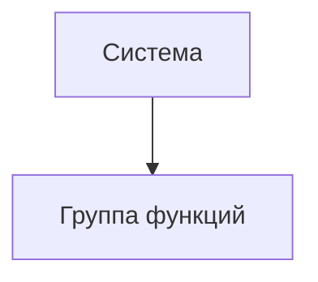

# Документ о концепции и границах кейса

| Поле | Значение |
|------|----------|
| Кейс | Расписание занятий в MAX |
| Индустриальный партнер | _организация / подразделение_ |
| Версия | `0.1-draft` |
| Дата | 2026-10-07 |
| Статус | Черновик |
| Авторы | Ежов Д.Д., Игнатов М.Р., Тюрин С.Т.|

## 1. Введение

Для учебного управления университета, которое собирает расписание на семестр и отправляет его до преподавателей и студентов, система расписания занятий в MAX — это мини-приложение и чат-бот в мессенджере MAX, которое автоматически загружает справочники из 1С:Университет ПРОФ, позволяет диспетчеру собрать расписание на сетке и публикует его в MAX с уведомлениями об изменениях.

В отличие от текущего способа работы, когда расписание собирается вручную в таблицах, а данные перепечатываются из информационных систем, решение использует уже имеющиеся данные и сокращает ручной ввод. Готовое расписание автоматически доходит до студентов и преподавателей в MAX.

## 2. Бизнес-контекст и цели

### 2.1. Исходные данные

Как процесс устроен сейчас, какие потери времени / денег / качества наблюдаются, на каких фактах это основано.

### 2.2. Возможности бизнеса

Что изменится, если решение появится; какие смежные возможности откроются позже.

### 2.3. Бизнес-цели

| ID | Цель | Масштаб | Способ измерения | База | План | Обязательный порог | Срок |
|----|------|---------|------------------|------|------|--------------------|------|
| BO-1 | Сократить время сборки расписания на семестр | Трудозатраты учебного управления |Замер времени от начала сборки до публикации | | −50%|−30% |В течение первого семестра после запуска |
| BO-2 | Обеспечить прозрачную загрузку преподавателей и аудиторий|Наличие отчётов в системе |Проверка доступности отчётов |всё вручную |2 отчёта |2 отчёта | К концу выпуска  |
| BO-3 |Донести расписание до студентов и преподавателей в MAX | Доля людей, видящих расписание в MAX|Статистика мини-приложения и чат-бота | 0% | ≥80% |≥60% |В течение 3 месяцев после запуска |

### 2.4. Видение решения

Одно-два предложения в формате: *для [пользователь], который [потребность], [имя системы] — это [тип продукта], который [ключевые возможности]. В отличие от [альтернатива], решение [отличие]*.

## 3. Стейкхолдеры

### 3.1. Профили заинтересованных лиц

| Заинтересованное лицо | Основная ценность | Отношение | Основные интересы | Ограничения |
|-----------------------|-------------------|-----------|-------------------|-------------|
| | | | | |

### 3.2. Матрица влияния / интереса

| Стейкхолдер | Влияние (низкое / среднее / высокое) | Интерес (низкий / средний / высокий) | Стратегия работы |
|-------------|--------------------------------------|--------------------------------------|------------------|
| | | | |

## 4. Функциональные требования

### 4.1. Основные функции

| ID | Функция | Краткое описание |
|----|---------|------------------|
| FE-1 | Автоматическая загрузка справочников из 1С:Университет| Факультеты, кафедры, аудитории, корпуса, преподаватели, группы, учебные планы, дисциплины|
| FE-2 | Сборка расписания диспетчером на сетке| Диспетчер раскладывает занятия по дням и парам, используя данные из 1С |
| FE-3 | Проверка конфликтов | Преподаватель, аудитория, группа чтобы не пересекались |
| FE-4 | Отчёты по загрузке преподавателей и аудиторий | Отдельные отчёты для учебного управления |
| FE-5 | Публикация расписания в MAX | Чат-бот |
| FE-6 | Уведомления об изменениях | Смена аудитории, перенос, отмена, замена преподавателя |

### 4.2. Дерево функций

### 4.3. Пользовательские истории / варианты использования

| Основное действующее лицо | Варианты использования |
|---------------------------|------------------------|
|Диспетчер/составитель расписаний | Сборка расписания, разрешение конфликтов, публикация расписания|
| Преподаватель | Просмотр своего расписания в MAX, получение уведомлений об изменениях |
| Студент | Просмотр расписания своей группы в MAX, получение уведомлений об изменениях |
| Учебное заведение | Согласование исключений, просмотр отчётов по загрузке |
| ИТ-отдел | Настройка интеграции с 1С, поддержка моральная |
| MAX | Доставка расписания студентам и преподавателям |

### 4.4. Детальный сценарий (минимум один)

#### UC-1. _Название_

| Поле | Значение |
|------|----------|
| Автор / дата | |
| Основное действующее лицо | |
| Дополнительные действующие лица | |
| Описание | |
| Условие-триггер | |
| Предварительные условия | PRE-1. |
| Выходные условия | POST-1. |
| Приоритет | высокий / средний / низкий |
| Частота использования | |
| Бизнес-правила | BR-… |

**Нормальное направление**

1.
2.

**Альтернативные направления**

- 1.1 …

**Исключения**

- 1.0.E1 …

**Другая информация**

-

**Предположения**

-

### 4.5. Сжатые сценарии (по образцу Вигерса)

Остальные UC можно описать короче, если ключевая информация уже есть в другом источнике.

#### UC-n. _Название_

- Описание:
- Исключения:
- Приоритет:
- Бизнес-правила:
- Другая информация:

## 5. Нефункциональные требования

| ID | Категория | Требование | Метрика / порог |
|----|-----------|------------|-----------------|
| NFR-P1 | Производительность | | |
| NFR-A1 | Доступность | | |
| NFR-S1 | Безопасность | | |
| NFR-C1 | Совместимость / IT-ландшафт | | |
| NFR-U1 | Удобство использования | | |

## 6. Границы кейса

### 6.1. In Scope

- …

### 6.2. Out of Scope

- …

### 6.3. Состав первого и последующих выпусков

| Функция | Выпуск 1 | Выпуск 2 | Выпуск 3 |
|---------|----------|----------|----------|
| FE-1 | | | |
| FE-2 | | | |

## 7. Ограничения и допущения

### 7.1. Ограничения и исключения

| ID | Формулировка |
|----|--------------|
| LI-1 | |

### 7.2. Предположения и зависимости

| ID | Тип | Формулировка |
|----|-----|--------------|
| AS-1 | допущение | |
| DE-1 | зависимость | |

### 7.3. Приоритеты проекта

| Область | Ограничения | Движущая сила | Степень свободы |
|---------|-------------|---------------|-----------------|
| Функции | | | |
| Качество | | | |
| Сроки | | | |
| Расходы | | | |
| Персонал | | | |

### 7.4. Особенности развертывания

Стек, инфраструктура, обучение пользователей, необходимые изменения смежных систем.

## 8. Риски

| ID | Риск | Вероятность (0–1) | Ущерб (1–10) | Митигация |
|----|------|-------------------|--------------|-----------|
| RI-1 | | | | |

> [!WARNING]
> Риски, которые могут сорвать приемку выпуска 1, вынесите сюда явно.

## 9. Критерии приемки

| ID | Критерий | Как проверяется | Порог | Срок |
|----|----------|-----------------|-------|------|
| SM-1 | | | | |
| AC-1 | | | | |

Партнер принимает работу, если выполнены все критерии со статусом «обязательный» и закрыты In Scope функции выпуска 1.
